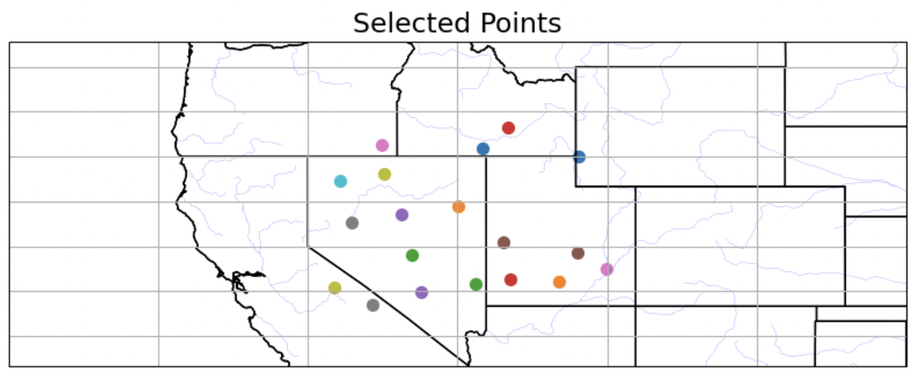
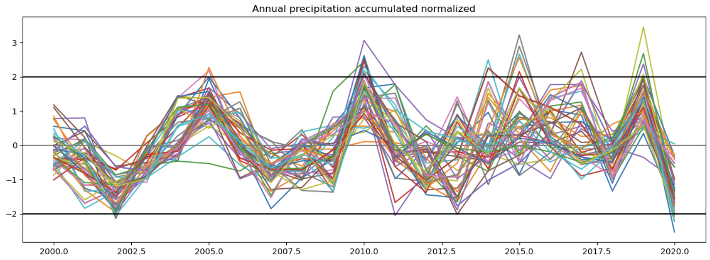
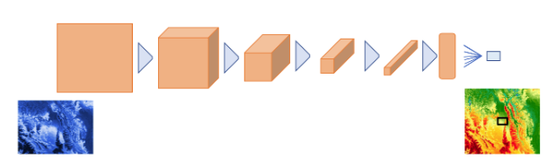
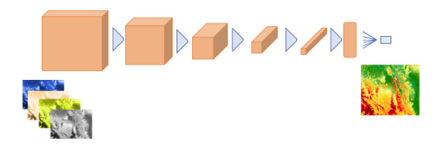
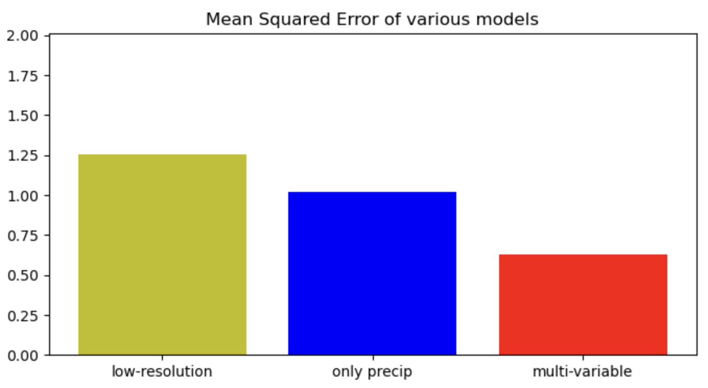

# PODO - POintwise DOwnscaling model for climate data

Final project for the 2022-2023 Postgraduate course on Artificial Intelligence with Deep Learning, UPC School.

Authored by Victor Estella, Juan Rivas and Maiol Valentí.

Advised by Amanda Duarte.

## Table of Contents

- [Repository structure](#Repository-structure)
- [Introduction and motivation](#Introduction-and-motivation)
- [Proposal](#Proposal)
- [Hypothesis](#Hypothesis)
- [Dataset](#Dataset)
  - [Datasets used](#Datasets-used)
  - [Data preprocessing](#Data-preprocessing)
  - [Later transformations and updates](#Later-transformations-and-updates)
- [Working environment](#Working-environment)
  - [Github](#Github)
  - [Miniconda](#Miniconda)
  - [Data preprocessing](#Data-preprocessing)
  - [Google Cloud](#Google-Cloud)
  - [Google colab](#Google-colab)
- [Computational resources](#Computational-resources)
- [Experiments](#Experiments)
- [Architecture](#Architecture)
- [Loss functions](#Loss-functions)
- [Metrics](#Metrics)
- [Setbacks](#Setbacks)
- [Results](#Results)
- [Conclusions](#Conclusions)
- [Additional experiments and developments](#Additional-experiments-and-developments)
- [How to to run the code](#How-to-to-run-the-code)
  - [Data preprocessing](#Data-preprocessing)
  - [CNN](#CNN)
  - [MLP](#MLP)

## Repository structure

The repository has three branches and the following structure:
  - Main: Data preparation, the CNN and MLP algorithms organized in folders. Plus a small dataset to basically run the code, and a folder with images used for this report.
  - Master: The initial “main” branch to upload our progress. Not used much despite a proposed initial files structure for the project.
  - Tests: Tests done during the development.

## Introduction and motivation

One of the main problems in predicting the climate today is the complexity and variability of the Earth's climate system. The climate is influenced by a multitude of factors, including changes in the atmosphere, ocean, land, and cryosphere (the frozen parts of the planet). Additionally, these factors interact with each other in complex ways that are difficult to model accurately.
Another challenge is the lack of complete and accurate data. Climate models require vast amounts of data, including historical climate observations, measurements of atmospheric and oceanic conditions, and information about land use and greenhouse gas emissions. However, many regions of the world lack sufficient monitoring systems, and some data may be incomplete or inaccurate.

Furthermore, there are uncertainties associated with climate models, such as the accuracy of model parameters and the representation of physical processes in the models. These uncertainties can affect the accuracy of the model's predictions and make it challenging to determine the precise impacts of climate change.

Finally, predicting the climate is complicated by the fact that human activities, such as greenhouse gas emissions, are driving changes in the climate system. These changes are difficult to predict accurately because they depend on future human behaviour and technological developments, as well as natural climate variability.
Addressing these challenges requires ongoing research and development of climate models, as well as improvements in data collection and monitoring systems. Additionally, it requires a concerted global effort to reduce greenhouse gas emissions and mitigate the impacts of climate change.

## Proposal

The main goal and the proposal of this project is to introduce deep learning techniques so we can improve the climate models' accuracy and predictive power. Climate models are complex, nonlinear systems with many variables, and deep learning models are particularly suited to analyzing such complex data sets. Here are a few reasons why deep learning is important in climate modelling:

  ** - Improved accuracy: **
  Deep learning models can learn complex relationships between input variables and output variables in a way that traditional statistical models cannot. This can lead to more accurate predictions of future climate patterns and more precise estimates of the impacts of climate change.
  ** - Large-scale data analysis: **
  Climate models rely on large amounts of data, and deep learning models can process vast amounts of data much faster than traditional statistical models. This can lead to a more efficient analysis of data and faster model development.
  ** - Nonlinear relationships: **
  Climate models are highly nonlinear, which means that small changes in one variable can have large effects on other variables. Deep learning models can handle these nonlinear relationships better than traditional models, which assume linear relationships between variables.
  ** - Improved representation of processes: **
  Deep learning models can be used to represent complex physical processes in climate models, such as cloud formation and ocean circulation. This can improve the accuracy of the model by incorporating more detailed information about the processes that drive climate patterns.

Overall, deep learning has the potential to significantly improve the accuracy and predictive power of climate models, which is critical for understanding the impacts of climate change and developing effective strategies for mitigating its effects.

## Hypothesis
Our general hypothesis for this project is that we can enhance precipitation forecasting through the use of a deep-learning model with convolutional layers. By leveraging data from a low-resolution dataset, we aim to simplify the process of improving prediction accuracy.

## Dataset
### Datasets used
The Dataset has been created by joining various public data sources:

i) The low spatial resolution data is obtained from the ERA5 reanalysis (https://cds.climate.copernicus.eu/cdsapp#!/dataset/reanalysis-era5-single-levels). The spatial resolution of the data is about 25 km with global coverage. Processed variables from this low resolution are mean daily temperature, maximum daily temperature, minimum daily temperature, daily relative humidity, precipitation and surface wind.

ii) Elevation data, obtained from WorldClim version 2.1 (https://www.worldclim.org/data/worldclim21.html) taken at 30 seconds resolution.

ii) The high-resolution data considered as target data is obtained from the Daymet dataset with a 1 km spatial resolution (https://daac.ornl.gov/DAYMET/guides/Daymet_Daily_V4R1.html). This dataset is only available in North America. The time span considered for this data is between 2000 and 2018, both included.

ii) Additional data used as input is a mask delimiting the land and ocean. It takes the value 1 if it is a land gridpoint and 0 if it is the ocean.

### Data preprocessing
The high-resolution dataset consists of a very high quantity of data points in North America that could be potentially trained as targets. We performed an initial random selection of 4000 locations of the original dataset and stored the data to make it more manageable. From this initial selection, 50 locations from the region of Nevada-Utah in the USA were selected as it is a region with considerable land contrasts that could benefit the training of the model. The figure below shows the 50 selected locations and the time series of the annual accumulated precipitation in those locations.

*Selected points*

*Annual precipitation*

For each of the 50 selected locations of the high-resolution dataset, an area of approximately 500x500 km centred around the location is selected from the low-resolution data and defined as input of the model. This input is used to predict the high-resolution value of precipitation.

For each of the locations the next steps are followed:
  - The low-resolution data consisting of 500x500 km around the location from ERA5 has been deseasonalized (removed the seasonal cycle to obtain anomalies) and normalized (to equate the different variables with very different values. Then regrid the data from a 25 km resolution to a 2.5 km resolution. The data is stacked together with the elevation data (already at a 2.5 km resolution) with the land-ocean mask into an array of dimensions 8x201x201 of dimensions variable-latitude-longitude.
  - A similar process is applied to the high-resolution precipitation time series with deseasonalization and normalization.
  - A random selection of 100 days for each of the years of the time series (both high resolution and low resolution) is stored as one file, one file per day of the year. This selection of 100 days out of the available 365 days of the year helped to contain the size of the dataset.

The resultant dataset remained contained within 102 Gb of data to be used as input for the model

### Structure of the dataset
Each of the files for each day and each year has two variables: input (with all the variables used as input for the network) and target with the single value of precipitation of the high-resolution model. The input variable consists of 8 variables 6 from the ERA5 dataset (mean daily temperature, maximum daily temperature, minimum daily temperature, daily relative humidity, precipitation and surface wind), with elevation and the land-ocean mask.

### Later transformations and updates

Due to further computational constraints, the initial 50 points were later reduced to about 25, eliminating points closer than 100 km to further reduce the size of the dataset to 39 Gb.

## Working environment
### Github
Github has been used as the main code repository point. The structure and how it has been used have been previously described in point 1.

### Miniconda
Miniconda has been used to isolate libraries or package installations required for the development. It has been important for developing in  Google cloud, since a VM (Virtual Machine) has been shared for the deployments between us.It also provides a quick start-up when sharing code if it is well-prepared with the requirements to be installed.

### Google Cloud
Google cloud has been a constant problem. We won't focus on the time we spent and invested to get the VM up and running, but we wasted a lot of time and it complicated things a lot.

Apart from this, we were able to create a VM on a personal Google account to work on the project. With the large volume of datasets we had (+100GB), it was quite key for us to be able to use Google Cloud. We created a VM with a fixed IP (to be able to connect via SSH to the same point always) and with the following features:
- 2 CPUs, 13RAM, 1GPU (NVIDIA T4 or NVIDIA P100) and 200GB Hard disk

The training took forever and was often interrupted, so we had to make use of a private server of the work of one of us to train the model and get some results. It is true that we have been able to do a experiment related to the hyperparameter tuning on Google Cloud (explained in the “extra” section), but with a very reduced dataset (6000 files and around 7GB in total) and a more expensive VM hardware configuration that was not an option for the CNN training because of the prices and long training.

### Google colab
It was mainly used in the first tests and trials, as it provides a quick way to execute code, share it and see the results. If our Dataset had been smaller we would probably have focused more on using it.

## Computational resources
The computational resources where the model was finally trained are:
- Private server used for training the large dataset with CPU 20 i9 Processors, 128 GB RAM and GPU 24 GB GDDR6

## Experiments
When we started the project, we thoroughly searched other people's work to gain insight into how they had tackled similar problems. After reviewing several projects, we found that the common approach was to use a relatively simple model based on convolutional layers. For our initial test, we followed suit and designed a CNN-based model with a final linear layer that had a single output, which would serve as our prediction.

Our ultimate goal was to treat the data as if it were images and predict the point that was situated precisely in the centre of each image. This point represents the precipitation at a low resolution. Our target was to predict this point from a higher-resolution dataset.

Two main experiments are performed under this architecture:
  - CNN-I only precipitation prediction - This experiment only considered the field of precipitation, the first dimension of the multi-variable input, as input for the prediction.
  - CNN-II multi-variable prediction - We also considered the other 7 additional variables as the next step of the previous experiment. The goal is to understand if, with the chosen architecture, the prediction is improved by bringing more variables that could, in theory, improve predictability.

## Architecture
The CNN model consists of four convolutional layers with a ReLU activation, dropouts and a max pooling layer. The input of the model is a single channel that receives the precipitation. After the last convolutional layer, the data gets flattened and passed through the fully connected layer to produce a single output value, which is directly the precipitation prediction.

Overall, this model can be used to downscale an image while preserving important features, which could be useful in various computer vision tasks such as image recognition and object detection.

The following images represent both architectures, almost the same.

*Single variable (precipitation) CNN architecture*

*Multi-variable CNN architecture*

## Loss functions
The chosen Loss function is a Mean Square Error (MSE) as we are fitting a regression model whose target is the precipitation at a high resolution.

## Metrics
Since we're dealing with a regression problem, we assess the validity of our model by calculating the difference between the predicted and target values. This approach helps us to accurately gauge the performance of our model and refine it accordingly.

Additionally, we considered as a benchmark the prediction performed by the low-resolution precipitation that would correspond to the target location. The goal of our experiments would be to improve such predictions.

## Setbacks
One of the main setbacks of this project was the data preprocessing. A large amount of available data for training had to be reduced to allocate the training process to a virtual machine of google cloud.

We have spent a lot of time configuring, preparing and using the VM in Google Cloud.
Very briefly: when we thought we had the VM ready in a google cloud account shared between the three of us, we ran into some limitations that prevented us from continuing. We switched to a personal account to create the VM again and we still faced some troubles, but finally, we could run the code. The training was going very slow and, luckily, we were able to switch to a private server for one of us to do it, and it went very great. In general, we had to dedicate a lot of time to Google Cloud. Thanks to Dani and Txus we were able to solve some issues faster.

## Results
An analysis has been performed with a fixed network parameter of learning rate to be fixed at 10-4 and the full dataset with 25 locations. We tested both predicting only with the low-resolution precipitation and the multi-variable low-resolution (8 variables used as predictors). The figure below shows the evolution of the loss through the 10 epochs of the training for both CNN models. Both show a reduction as the epochs evolve together with the test loss, indicating good progress in the training.

*Precipitation and multivariable results*

The two stars on the right of each figure indicate the values of the loss in the validation test (grey) and the loss computed with the low-resolution estimate, our benchmark (red). The comparison of these quantities is shown more illustratively in the next figure. It shows the values of the loss (Mean Squared Error) in the validation set, for the two experiments: using only the precipitation (in blue) as the predictor and the full input (8 variables, multi-variable in red). The prediction delivered by the low-resolution precipitation estimate is shown in yellow, and it is defined as our benchmark.

*MSE results for various models*

The values obtained by the CNN in both cases are better than the error obtained in the benchmark prediction, which is one of the milestones of this project. When comparing the two experiments, the multi-variate outperforms the only precipitation model by reducing the error to about 50% of the benchmark error.

## Conclusions
The main conclusions from this work can be summarized as:
  - For climate data and the type of problem we are addressing, data preprocessing is a very important part of the work and, in our case, we underestimated the needed work. As well as the need for knowing how to deal with large datasets in terms both of infrastructure and training the model.
  - Understanding and looking at the data is an important point to take into account. As well as being able to analyze the data in the dataset. For instance, plotting the data to check if we have some anomalies.
  - The results showed that a CNN is a good approach for this problem, as it has reduced the error with respect to the baseline prediction with our first experiment using only the low-resolution precipitation.
  - A more complex model using multiple variables as input (precipitation and other 7) delivers a very good performance by reducing the benchmark error by half in the validation dataset.
  - Google Cloud has been a constant problem. A better analysis of what the cloud can really bring to the project is important. The training was completed on another private server.

## Additional experiments and developments
An extra MLP has been developed to see its performance with the same problem. In addition, we have taken advantage of its simple architecture to develop a hyperparameter tuning with Ray Tune. It has been trained with just one variable, precipitation.

Since we were dealing with a regression problem, we had to avoid using a non-linear activation function in the output of the last layer in order to obtain the "real" value of the prediction. In the hidden layers a ReLU has been used since it does not affect the positive values but for the negative ones by changing them to 0. Probably we could have also used it in the last layer (output), but we think that it would not have made a difference.

## How to to run the code
### Data preprocessing
Instructions for how to use the project, including any command-line options or other configuration settings.

### CNN
Instructions for how to use the project, including any command-line options or other configuration settings.

### MLP
Instructions for how to use the project, including any command-line options or other configuration settings.
